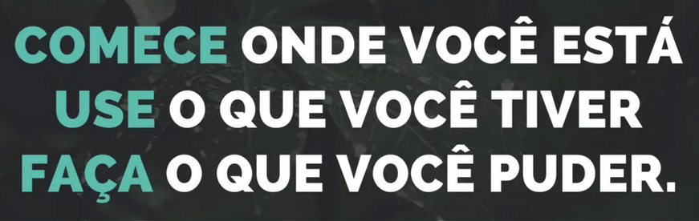

# 📃 Minhas certificações 

Como forma de organizar e disponibilizar de maneira fácil e eficiente a recrutadores ou mesmo clientes que queiram conhecer mais sobre mim e minhas certificações, criei esse repositório onde armazeno meus principais certificados de cursos e treinamentos.

  

 

  

## 🗃️ Lista de cursos e links

- [Linux fundamentos - 21/07/2022](certificates/linux-fundamental-839dadd4bc998a0d53a605cd435b8cec.png

- [Introdução prática ao Figma - 19/04/2022](certificates/19-04-22-Introdu%C3%A7%C3%A3o%20pr%C3%A1tica%20ao%20Figma.pdf)

- [Introdução ao Git e GitHub - 16/04/2022](certificates/16-04-22-Introdu%C3%A7%C3%A3o%20ao%20Git%20e%20GitHub.pdf)

- [Gerência de projetos - 17/07/2020](certificates/15-07-20-Certificado%20Gerencia%20de%20projetos.pdf)

- [Serviços de rede - 26/05/2020](certificates/26-05-20-Certificado%20Servi%C3%A7os%20de%20rede.pdf)

- [Protocolos de redes - 23/05/2020](certificates/23-05-20-Certificado%20Protocolos%20de%20redes.pdf)

- [Segurança em redes Microsoft - 23/05/2020](certificates/23-05-20-Certificado%20Seguran%C3%A7a%20em%20redes%20Microsoft.pdf)

- [Gestão de pessoas - 17/05/2020](certificates/17-05-20-Certificado%20Gest%C3%A3o%20de%20pessoas.pdf)

- [Tecnologia da informação e comunicação - 03/04/2020](certificates/03-04-20-Tecnologia%20da%20informacao%20e%20comunicacao.pdf) 

- [Specialization 121P - 20K Coesia Group GD - 19/04/10](certificates/19-04-19-Specialist-121P-20K.pdf)

- [TIA Portal Siemens 1500 - 11/01/19](certificates/11-01-19-Certificado%20Orkan%20CLP%20Siemens%201500.pdf)

- [Técnico Senai em Eletrotécnica - 21/12/16](certificates/21-12-16-Tecnico%20Senai%20frente.pdf)

 

## 🎚️ Próximos cursos
- [ ] Fazer curso de Design UX do Google
- [ ] Concluir curso superior em Gestão Comercial 33% concluído.
